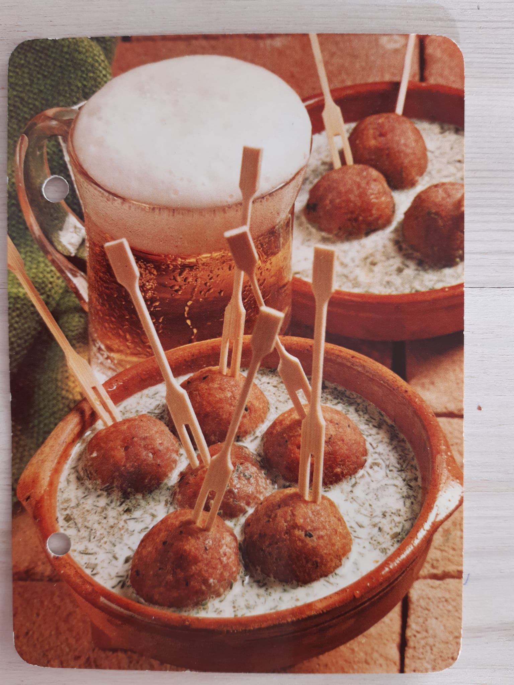
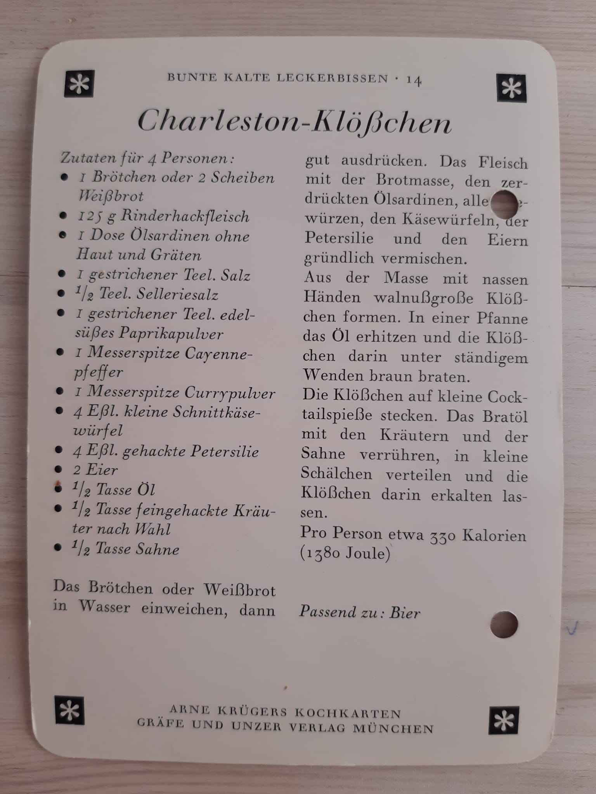

# Charleston-Klößchen

aus der Reihe *Bunte kalte Leckerbissen*

## Zutaten für 4 Personen
* 1 Brötchen oder 2 Scheiben Weißbrot
* 125g Rinderhackfleisch
* 1 Dose Ölsardinen ohne Haut und Gräten
* 1 gestrichener Teel. Salz
* 1/2 Teel. Selleriesalz
* 1 gestrichener Teel. edelsüßes Paprikapulver
• 1 Messerspitze Cayennepfeffer
* 1 Messerspitze Currypulver
* 4 Eßl. kleine Schnittkäse würfel
* 4 Eßl. gehackte Petersilie
* 2 Eier
* 1/2 Tasse Öl
* 1/2 Tasse feingehackte Kräuter nach Wahl
* 1/2 Tasse Sahne

## Zubereitung
Das Brötchen oder Weißbrot in Wasser einweichen, dann gut ausdrücken. Das Fleisch mit der Brotmasse, den zerdrückten Ölsardinen, allen Gewürzen, den Käsewürfeln, der Petersilie und den Eiern gründlich vermischen.

Aus der Masse mit nassen Händen walnußgroße Klößchen formen. In einer Pfanne das Öl erhitzen und die Klößchen darin unter ständigem Wenden braun braten.

Die Klößchen auf kleine Cocktailspieße stecken. Das Bratöl mit den Kräutern und der Sahne verrühren, in kleine Schälchen verteilen und die Klößchen darin erkalten las sen.

## Hard facts
Pro Person etwa 330 Kalorien (1380 Joule)
Passend zu: Bier

Copyright: ARNE KRÜGERS KOCHKARTEN
GRÄFE UND UNZER VERLAG MÜNCHEN