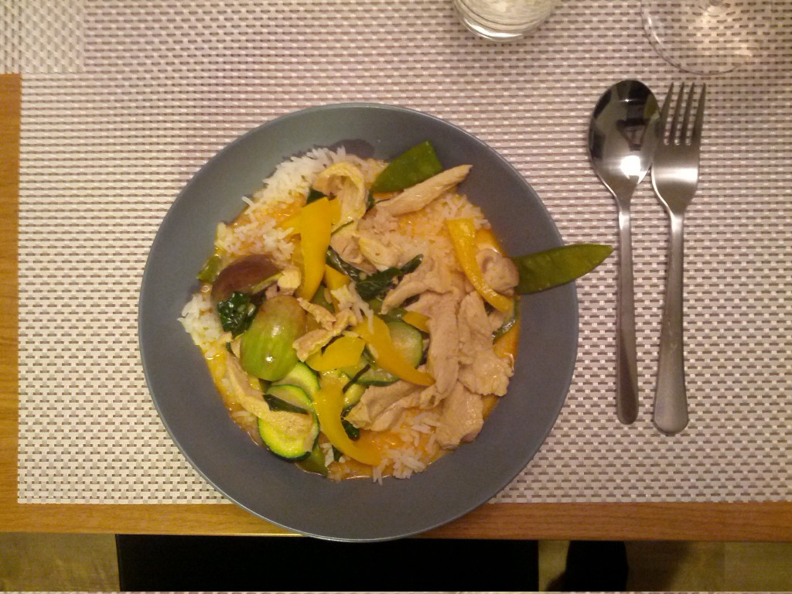
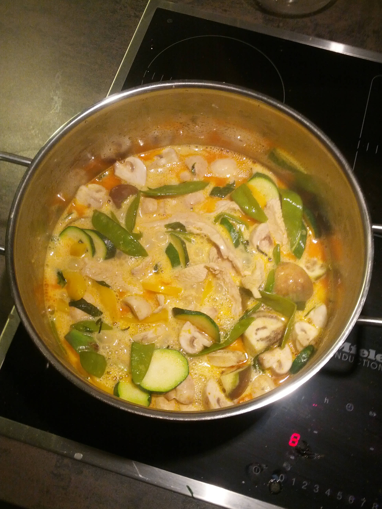
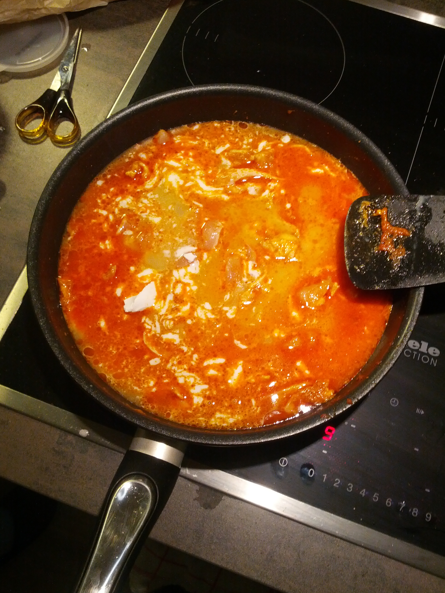
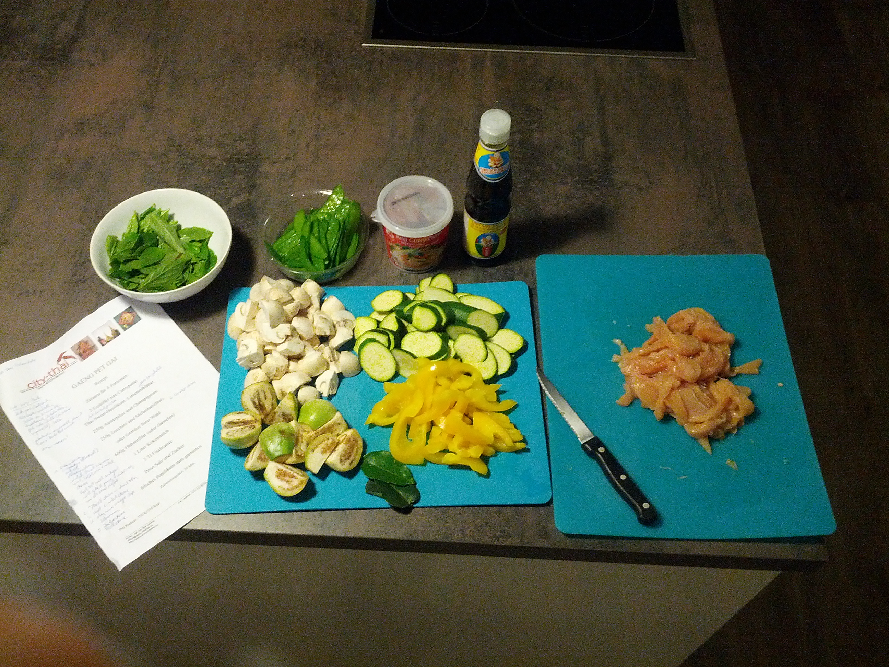

# Gaeng Pet Gai (Red Curry)

## Ingredients for four persons

- 2 tsp of red curry paste
- sweet Thai basil
- Kaffir-lime leaves
- 250g champignons
- 250g zucchini
- 250g Thai melanzani
- vegetables you like
- 600g chicken filet or prawns
- 1 liter coconut milk (check for Thailand origin)
- 3 tbs fish sauce
- a pinch of salt
- a pinch sugar
- vegetable oil
- fresh basil
- jasmin rice

## Howto

1. wash the rice twice and cook the rice (without salt)
2. cut everything and make sure the meat is sliced in thin pieces
3. roast the currypaste in vegetable oil and constantly stir in order to avoid the paste to stick to the wok
4. after the smell has started to become intensive add the coconut milk spoon by spoon while stirring the paste
5. when the paste resembles bolognese sauce, put in the meat in and roast it a little bit
6. deglaze with the rest of the coconut milk
7. add sugar
8. season it with fish sauce
9. put the vegetables in

  
