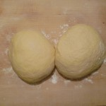
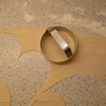

# Kärntner Kasnudeln

## What you need

- 1kg of potatoes
- 720g flour
- 3 eggs
- 3 tablespoon of oil
- 3/8l water
- 1kg creamcheese
- parsley
- lots of chives
- mint
- chervil

## How you do it

### FILLING

1. cook the potatoes
2. squeeze the potatoes and put them in a bowl
3. add the cream cheese and the cut herbs
4. don't forget to add salt and pepper

### DOUGH

1. mingle flour, eggs, oil and water
2. work hard in kneading the dough to get a consistent dough. Add more water or flour if necessary
3. cover the dough with a tea towel and let it rest for half an hour

### End Game

1. roll out the dough to a thickness of 3 mm. Yes, that's hard work!
2. cut out round pieces of approximately 8cm on diameter and put half a teaspoon full of the filling on it
3. pull the dough over and make sure the filling is well enclosed
4. afterwards, you can boil the kasnudeln in hot water. Mind that the water should not boil! Simply simmer until the kasnudeln come to the surface

